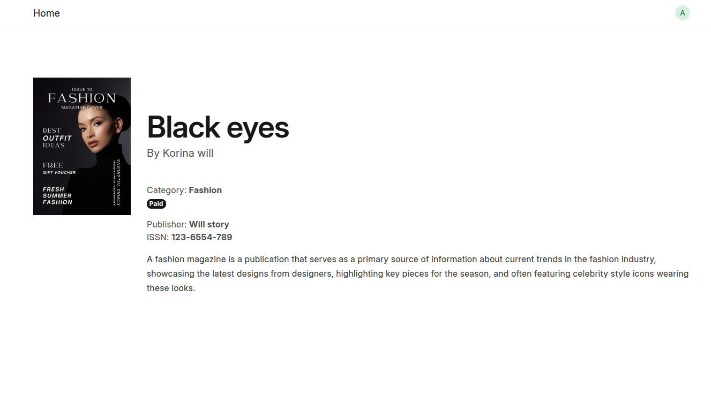
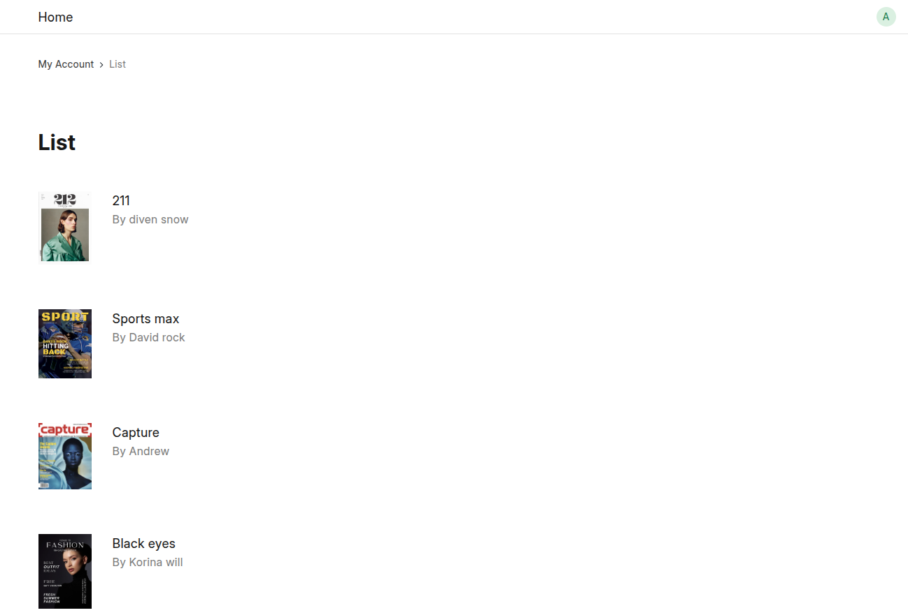
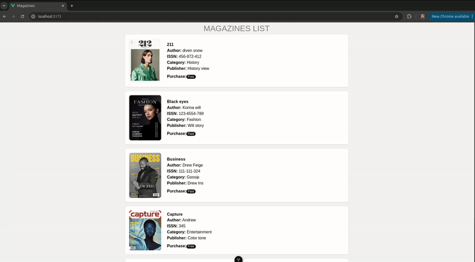
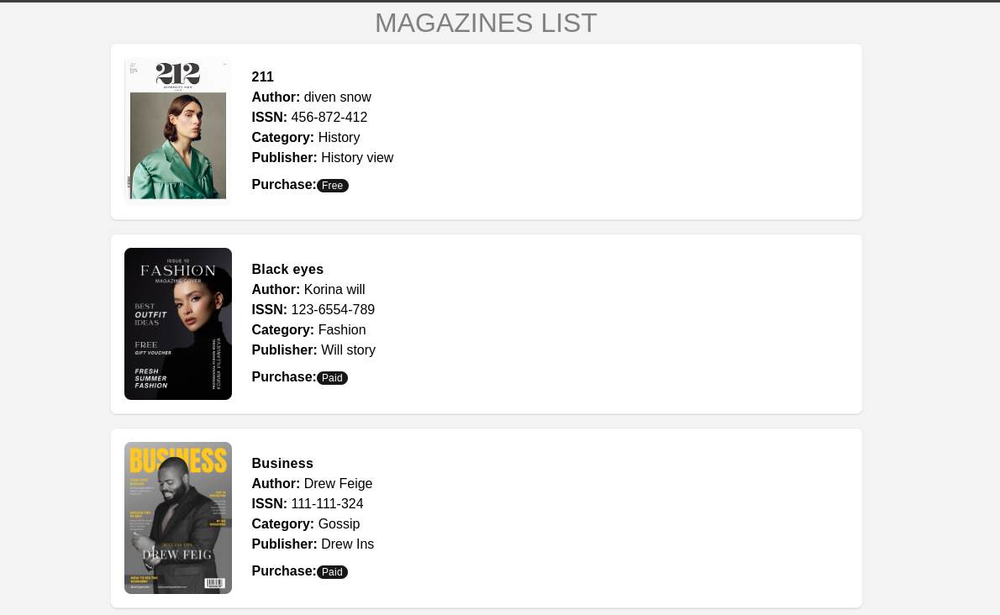
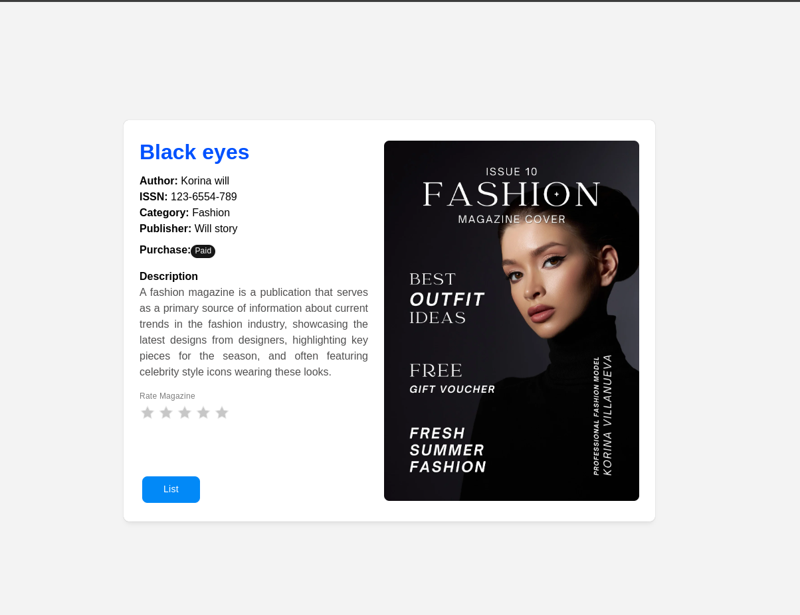

<h1>Magazines Management System</h1>
This App is developing in Linux ubuntu 24.04.1 LTS

So, I am going to develop Books Management System
Using frappe and Jinja + Bootstrap

First of all let's create an App:
Open terminal (ctrl + Alt + t)
Run this command under frappe-bench directory
<br>
<code>$ bench new-app magazines_management</code>
<br>
<br>
Congrats we have created our app within a second!
Now, we're going to create our site.
Run this command under frappe-bench directory
<br>
<code>$ bench new-site book.localhost</code>
<br>
<br>
Congrats we have created our site 
so now we can open on browser and can do further process
But before going to browser we need to tell our operating system that magazines.localhost should point to localhost.
so to do this we need to add this (127.0.0.1 magazines.localhost)
How can we do and where we have to add this?
so we need to add at /etc/hosts file.
we can do it manually by navigate in hosts file and add manually, Just write:
127.0.0.1 books.localhost
But there is another way just run this:
<br>
<code>$ bench --site magazines.localhost add-to-hosts</code>
<br>
<br>
So, Open any browser (Recommanded Chrome)
and Type http://magazines.localhost:8002/#login
This will show credentials for login
<br>

<br>
Now Install app on site
Run this command under frappe-bench directory
<br>
<code>$ bench --site magazines.localhost magazines_management</code>
<br>
To check the app installed?
Run this command to check the app installed or not!
<br>
<code>$ bench --site magazines.localhost list-apps</code>
<br>
This should show our app(book_management) and frappe(default)

<br><br>
### Let's setup desk of application
First of all create all doctypes that needed.
#### Create Book Doctype 
* Step: 1 Search for doctype list in search bar <br>

<br>

* Step: 2 Click to button +Add DocType
* Step: 3 File Module with Magazines Management and doctype name is Magazine
* Step: 4 Save
* Step: 5 Go to Fields
* Add Row

| Label          | Data Type        | Name        |
|----------------|------------------|-------------|
| Magazine Name      | Data             | book_name   |
| Author         | Data             | author      |
| Image          | Attach Image     | image       |
| ISSN           | Data             | isbn        |
| Status         | Select           | status      |
| Publisher      | Data             | publisher   |
| Description    | Text Editor      | description |
| Route          | Data             | route       |
| Published      | Check            | published   |

<br>
It should look like:
<br>


<br><br>
#### Create Magazine Reader Doctype
* Go to fields
* Add Row

| Label          | Type            | Name        | Options          |
|----------------|-----------------|-------------|------------------|
| First Name     | Data            | first_name  |                  |
| Last Name      | Data            | last_name   |                  |
| Full Name      | Data            | full_name   |                  |
| Email Address  | Data            | email_address | Email          |
| Phone          | Data            | phone       |                  |

<br>
It Should look like:
<br>

<br><br>
#### Create Magazine Subscription Doctype
* Go to fields
* Add Row

| Label           | Type  | Name           | Mandatory | Options             |
|------------------|-------|----------------|-----------|---------------------|
| Magazine Reader  | Link  | magazine_reader| true      | Magazine Reader     |
| Full Name        | Data  | full_name      |           |                     |
| From Date        | Date  | from_date      |           |                     |
| To Date          | Date  | to_date        |           |                     |
| Paid             | Check | paid           |           |                     |
| Amended From     | Link  | amended_from   |           | Library Membership  |

<br>
It should look like:
<br>


<br><br>
#### Create Magazine Transaction Doctype
* Go to fields
* Add Row

| Label           | Type   | Name           | Mandatory | Options               |
|------------------|--------|----------------|-----------|----------------------|
| MAgazine        | Link   | magazine       | true      | Magazine              |
| Magazine Reader | Link   | amended_from   | true      | Magazine Reader       |
| Type            | Select | type           |           | Issue, Return         |
| Date            | Data   | date           | true      |                       |

So, Four Doctypes are created.

#### Let's create a role with name od Admin (who have the access to add magazines)
* Step: 1 search for role
* Step: 2 create new role
* Step: 3 set Role Permissions Manager
* Step: 4 Give access to Librarian (create, read, delete, write, print, report, export, share)
* Step: 5 Give Admin role access to Doctypes (Magazine,Magazine Subscription, Magazine Transaction)

<br>
<hr>

### Go to doctype directory in app and navigate to template

```bash
$ cd frappe-bench/apps/magazines_management/magazines_management/magazines_management/doctype/magazines/template/
```
There are two default files:<br>
I. magazine.html <br>
II. magazine_raw.html <br>
<br>
I. First file is for a specific card of magazine <br>
II. List of the all magazines <br>
Code of magazine.html

```bash




<div class= "py-20 row">
<div class="col-sm-2">

</div>
<div class="col">
<h1>{{title}}</h1>
<p class="lead">By {{author}}</p>
<div>Category:  <strong>{{category}}</strong> </div>
<div>
                    
                    <span class="badge badge-success">Free</span>
                      
                    <span class="badge badge-primary">Paid</span>
                    
</div>
<div class="mt-4">
<div> Publisher: <strong>{{publisher}}</strong></div>
<div> ISSN: <strong>{{issn}}</strong></div>
</div>
<p>{{description}}</p>
</div>
</div>

} 
```

Output:<br>
magazine.html 
<br>

<br>
Code of magazine_row.html

```bash
<div class= "py-8 row">
<div class="col-sm-1">

</div>
<div class="col">
<a class="font-size-lg" href="{{doc.route}}"> {{doc.name}}</a>
<p class="text-muted">By {{doc.author}}</p>
</div>
</div>
```
Output:<br>
magazine_row.html
<br>

<br>

# Let's integrate FrappeUI

#### Navigate to the /www directory

<code>~/frappe-bench/apps/magazines_management/magazines_management/www/</code>

###### Steps to setup VueJS, TailwindCSS and FrappeUI.

#####  npm create vue@latest

- Project name: Magazines Management
- Add TypeScript? No (unless you want TypeScript)
- Add JSX Support? No
- Add Vue Router? No
- Add Pinia for state management? No
- Add Vitest for testing? No
- Add ESLint for code quality? Yes (optional)
- Add Prettier for code formatting? Yes (optional)

##### Install TailwindCSS

###### Dependencies

<code>npm install -D tailwindcss postcss autoprefixer</code>

This will create config file ot tailwindCSS

<code>npx tailwindcss init</code>

###### Steps to setup TailwindCSS

- Replace the path with it:
- In tailwind.config.js
```bash
export default {
  content: ['./index.html', './src/**/*.{vue,js,ts,jsx,tsx}'],
  theme: {
    extend: {},
  },
  plugins: [],
};
```

- Add TailwindCSS directives: Create a new file in:
<code>src/assets/tailwind.css</code>

```bash
@tailwind base;
@tailwind components;
@tailwind utilities;
```
- Import TailwindCSS in src/main.js
```bash
import { createApp } from 'vue';
import App from './App.vue';
import './assets/tailwind.css';

createApp(App).mount('#app');

```
- Create file in root of project:
<code>/www/postcss.config.js</code>

```bash
export default {
    plugins: {
      tailwindcss: {},
      autoprefixer: {},
    },
  };

```
So now TailwindCSS features can be use now.

##### Integrate FrappeUI

<code>npm install frappe-ui</code>

###### Steps to setup FrappeUI

- Open tailwind.config.js
- Add following code

```bash
/** @type {import('tailwindcss').Config} */
import tailwindConfig from "frappe-ui/src/utils/tailwind.config";

export default {
  presets: [tailwindConfig],
  content: [
    "./index.html",
    "./src/**/*.{vue,js,ts,jsx,tsx}",
    "./node_modules/frappe-ui/src/components/**/*.{vue,js,ts,jsx,tsx}",
		"../node_modules/frappe-ui/src/components/**/*.{vue,js,ts,jsx,tsx}",
    ],
  theme: {
    extend: {},
  },
  plugins: [],
};
```
- Open vite.config.js
- Add following line at the bottom

```bash
 optimizeDeps: {
		include: ["frappe-ui > feather-icons", "showdown", "engine.io-client"],
	},
```
- vite.config.js

```bash
import { fileURLToPath, URL } from 'node:url'

import { defineConfig } from 'vite'
import vue from '@vitejs/plugin-vue'
import vueDevTools from 'vite-plugin-vue-devtools'

export default defineConfig({
  plugins: [
    vue(),
    vueDevTools(),
  ],
  resolve: {
    alias: {
      '@': fileURLToPath(new URL('./src', import.meta.url))
    },
  },
  optimizeDeps: {
		include: ["frappe-ui > feather-icons", "showdown", "engine.io-client"],
	},
})
```
##### Import FrappeUI components in main.js
###### These are the components that used in Magazine application
- Button
- Spinner
- Badge
- Spinner 
- main.js

```bash
import './assets/tailwind.css';
import { Button, Rating,Badge,Spinner } from 'frappe-ui'
import { createApp } from 'vue'
import router from './router';
import App from './App.vue'
const app = createApp(App)
app.component("Button", Button);
app.component("Badge",Badge);
app.component("Rating",Rating)
app.component("Spinner",Spinner);
app.use(router)
app.mount('#app')
```
#### Now setup is completed
###### Let's create Vuejs components to display magazines on browser

- Install router
<code>npm install vue-router</code>

- Create router.js in
<code>/www/src/router.js</code>

```bash
import { createRouter, createWebHistory } from "vue-router";
import Magazines from "@/components/Magazines.vue"; 
import Magazine from "@/components/Magazine.vue"; 

const routes = [
  {
    path: "/",
    name: "Home",
    component: Magazines,
  },
  {
    path: "/magazine/:name",
    name: "Magazine",
    component: Magazine,
    props: true,
  },
];

const router = createRouter({
  history: createWebHistory(),
  routes,
});

export default router;
```
- Update App.vue file
```bash
<template>
  <div id="app">
    <router-view></router-view>
  </div>
</template>

<script>
export default {
  name: "App",
};
</script>

<style>
body {
  margin: 0;
  font-family: Arial, sans-serif;
}
</style>
```

- Create Vuejs components
- Magazines.vue (List of magazines)
- Magazine.vue (Detail of specific magazine)
- Here are the both files:

- [Magazines.vue](./images/Magazines.vue)
- [Magazine.vue](./images/Magazine.vue)

### Output




### Magazines List



### Magazine detail



